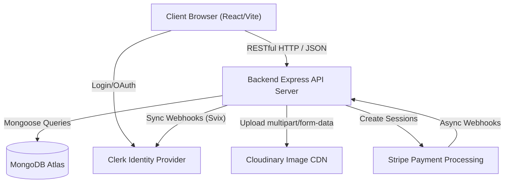
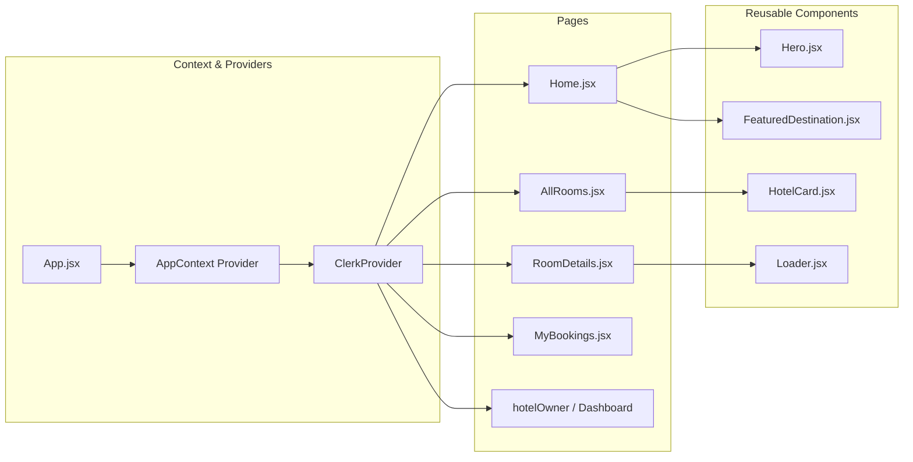
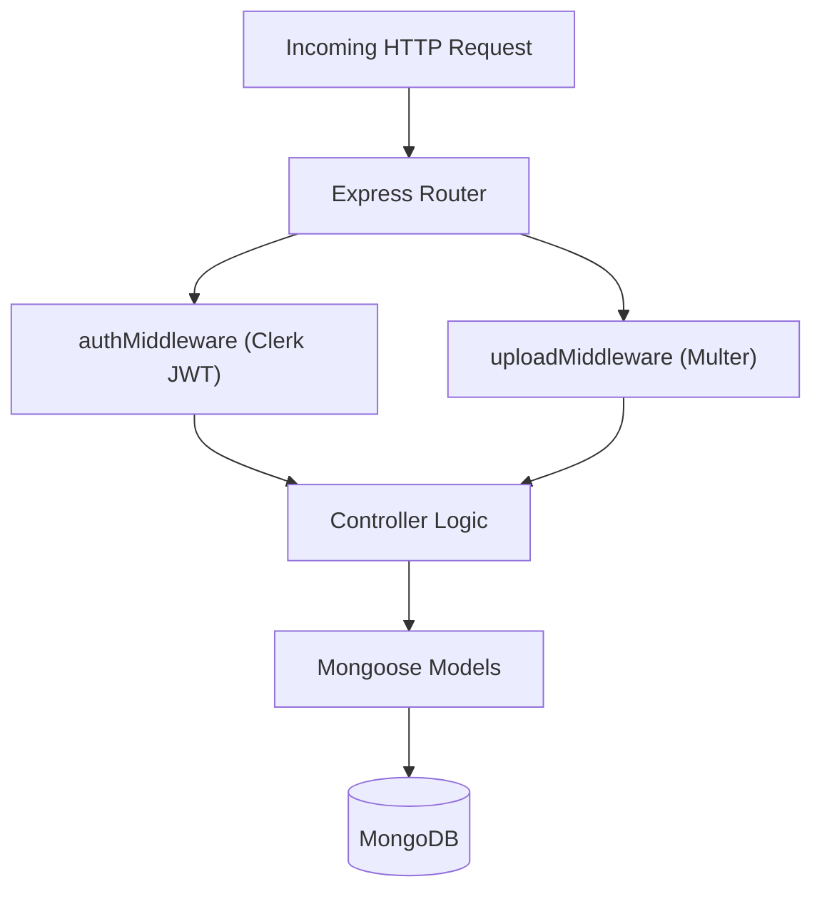
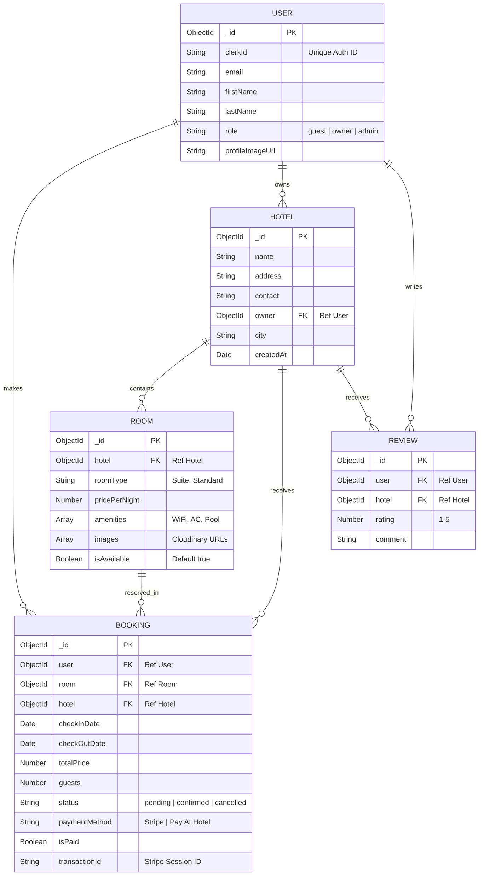
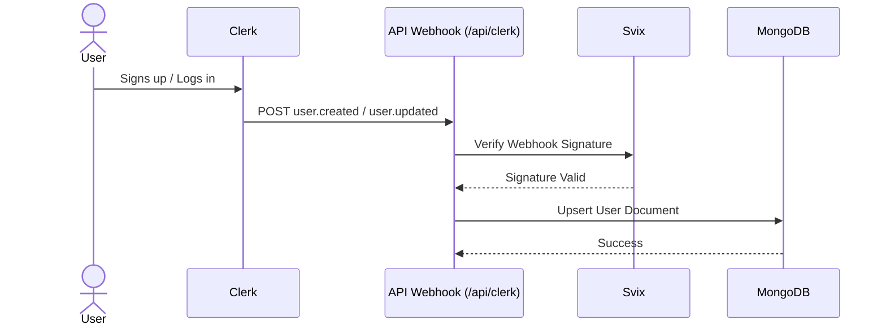
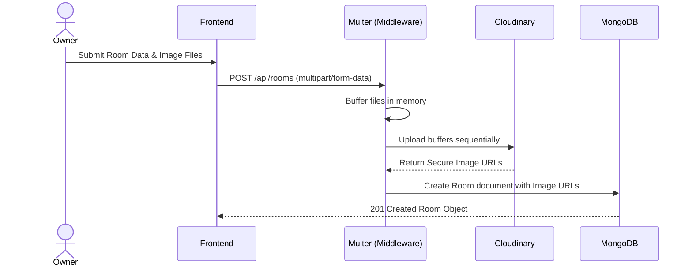
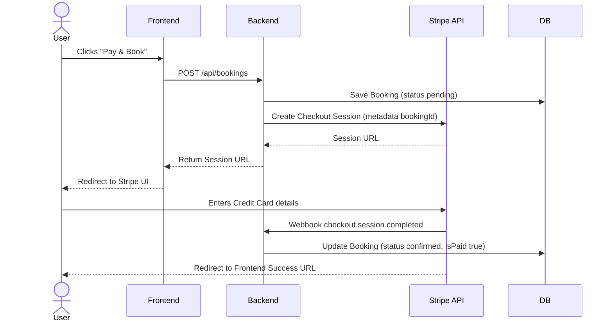

# 🏨 QuickStay - Ultimate Hotel Booking System (Enterprise Edition)

> **QuickStay** is a meticulously designed, full-stack, enterprise-grade web application for discovering, booking, and managing hotel accommodations. It provides a rich feature set for regular users and property owners, backed by a scalable, microservices-inspired monolithic architecture.

---

## 📖 1. Exhaustive Feature Matrix

### 👤 Guest (User) Features
- **Authentication & Security:** Secure OAuth and passwordless login via **Clerk**.
- **Advanced Search & Filtering:** Filter rooms by location, amenities, price range, and date availability.
- **Dynamic Browsing:** View rich hotel details, image galleries, and comprehensive lists of amenities.
- **Seamless Booking Flow:** Add guests, select check-in/check-out dates, and calculate total pricing dynamically.
- **Secure Payments:** Industry-standard payment processing via **Stripe Checkout**.
- **Booking Management:** View past, present, and upcoming bookings in the "My Bookings" dashboard.
- **Rating & Reviews:** Submit star ratings and written reviews for previously booked hotels/rooms.

### 🏢 Hotel Owner Features
- **Property Registration:** Register new hotels with names, addresses, contact info, and cities.
- **Room Management:** Add new rooms, specify room types (e.g., Suite, Standard), define price per night, and list amenities.
- **Media Uploads:** Upload multiple high-resolution images per room (handled securely by **Cloudinary**).
- **Availability Toggling:** Instantly mark rooms as unavailable or available for maintenance/blocking.
- **Owner Dashboard:** View all incoming bookings, manage active rooms, and track revenue across properties.

---

## 🚀 2. Comprehensive Technology Stack

### 🖥️ Frontend (Client)
- **Framework:** React.js (v19)
- **Build Tool:** Vite
- **Routing:** React Router v7
- **Styling:** Tailwind CSS (v4)
- **Animations:** Framer Motion
- **Notifications:** React Hot Toast
- **API Communication:** Axios
- **Authentication Wrapper:** `@clerk/clerk-react`

### ⚙️ Backend (Server)
- **Runtime Environment:** Node.js (v18+)
- **Framework:** Express.js (v5)
- **Database ORM:** Mongoose (v8)
- **Authentication & Webhooks:** `@clerk/express`, `svix` (Webhook signature verification)
- **Payment Processing:** `stripe` (v20)
- **File Parsing & Uploads:** `multer`, `cloudinary`
- **Email Notifications:** `nodemailer`
- **Security:** `cors`, `dotenv`

### 🐳 DevOps & Deployment
- **Containerization:** Docker, Docker Compose
- **Hosting:** Vercel (Frontend & Backend configurations included via `vercel.json`)

---

## 🏗️ 3. Deep Architectural Design

The system relies on a **Client-Server Architecture** utilizing a RESTful API.

### 🌐 High-Level Architecture (HLD)



### 🧩 Frontend Low-Level Design (LLD)
The React frontend uses **Context API** (`AppContext.jsx`) for global state management (handling active user context, loaded hotels, booking states).



### ⚙️ Backend Low-Level Design (LLD)
The Express backend follows a strict **Route -> Middleware -> Controller -> Model** separation of concerns.



---

## 🗄️ 4. Exhaustive Database Schema Design

The MongoDB database maintains high referential integrity using ObjectIDs.



---

## 🌊 5. Core System Workflows

### 🔐 5.1 Authentication Sync Workflow (Clerk Webhooks)
User data is managed by Clerk and synchronized to our MongoDB database automatically via cryptographically verified webhooks.


### 🖼️ 5.2 Room Creation & Media Upload Flow


### 💳 5.3 Asynchronous Payment Flow (Stripe)


---

## 🔌 6. Comprehensive API Reference

All protected routes require a Bearer JWT provided by Clerk. Checked via `authMiddleware.js`.

### 👤 User & Auth Routes (`/api/user`, `/api/clerk`)
| Method | Endpoint | Auth | Purpose |
|--------|----------|------|---------|
| POST | `/api/clerk` | No | Clerk Webhook receiver (Requires Svix signature header). |
| GET | `/api/user` | Yes | Retrieves the profile of the currently authenticated user. |

### 🏨 Hotel Routes (`/api/hotels`)
| Method | Endpoint | Auth | Purpose |
|--------|----------|------|---------|
| GET | `/api/hotels` | No | List all registered hotels. |
| GET | `/api/hotels/:id`| No | Get specific hotel by ID. |
| POST | `/api/hotels` | Yes* | Register a new hotel. *(Requires Owner Role)* |
| PUT | `/api/hotels/:id`| Yes* | Update hotel info. *(Must own the hotel)* |
| DELETE | `/api/hotels/:id`| Yes* | Delete a hotel property. *(Must own the hotel)* |

### 🛏️ Room Routes (`/api/rooms`)
| Method | Endpoint | Auth | Purpose |
|--------|----------|------|---------|
| GET | `/api/rooms` | No | Search rooms (query params: `hotelId`, `type`, `maxPrice`). |
| GET | `/api/rooms/:id` | No | Get comprehensive room details including image arrays. |
| POST | `/api/rooms` | Yes* | Upload new room with images (Uses Multer multipart). |
| PUT | `/api/rooms/:id` | Yes* | Update room specifics and availability. |
| DELETE | `/api/rooms/:id` | Yes* | Delete a room. |

### 💳 Booking Routes (`/api/bookings`, `/api/stripe`)
| Method | Endpoint | Auth | Purpose |
|--------|----------|------|---------|
| POST | `/api/bookings` | Yes | Initiate a booking. Returns Stripe Session URL. |
| GET | `/api/bookings/user`| Yes | Get all bookings for the requesting user. |
| GET | `/api/bookings/hotel/:id`| Yes*| Get all bookings for a specific hotel (Owner only). |
| PUT | `/api/bookings/:id/status`| Yes | Update booking status (`cancelled`, etc). |
| POST | `/api/stripe` | No | Stripe Webhook. Parses raw body to verify payment status. |

### ⭐ Review Routes (`/api/reviews`)
| Method | Endpoint | Auth | Purpose |
|--------|----------|------|---------|
| POST | `/api/reviews` | Yes | Submit a rating (1-5) and comment for a hotel. |
| GET | `/api/reviews/hotel/:id`| No | Retrieve all reviews and average rating for a hotel. |

---

## ⚙️ 7. Environmental Variables Checklist

To run this application, you must populate the environment variables exactly as outlined below.

### Backend (`Backend/.env`)
```env
# Server
PORT=3000
NODE_ENV=development

# MongoDB
MONGODB_URI=mongodb+srv://<username>:<password>@cluster...

# Clerk Webhooks
CLERK_WEBHOOK_SECRET=whsec_...

# Cloudinary
CLOUDINARY_CLOUD_NAME=...
CLOUDINARY_API_KEY=...
CLOUDINARY_API_SECRET=...

# Stripe
STRIPE_SECRET_KEY=sk_test_...
STRIPE_WEBHOOK_SECRET=whsec_...

# Client URL for CORS & Stripe Redirects
CLIENT_URL=http://localhost:5173
```

### Frontend (`frontend/.env`)
```env
# Clerk Public Keys
VITE_CLERK_PUBLISHABLE_KEY=pk_test_...

# Backend API URL
VITE_API_URL=http://localhost:3000
```

---

## 🖥️ 8. Local Setup & Deployment Guide

### Option 1: Full Dockerization (Easiest)
Make sure Docker Desktop is running.
```bash
# Clone repo
git clone <repository_url>
cd Hotel-Booking

# Ensure both .env files are created as above

# Build and start the containers
docker-compose up --build -d
```
* The Frontend will be accessible at `http://localhost:5173`
* The Backend will be accessible at `http://localhost:3000`

### Option 2: Standard Node.js Execution
Requires Node.js v18+.

**Step 1: Start the Backend Server**
```bash
cd Backend
npm install
npm run dev
# Runs on port 3000 using Nodemon
```

**Step 2: Start the Frontend Vite Server**
```bash
cd frontend
npm install
npm run dev
# Runs on port 5173
```

### Deployment Architecture (Vercel)
The repository includes `vercel.json` configurations.
- The `frontend` is built using `vite build` and served as static assets.
- The `Backend` uses Vercel Serverless Functions (`server.js` acts as the entrypoint for Express). Ensure the environment variables are mapped in the Vercel project settings.

---

## 🛡️ 9. Deep Security Paradigms

1. **Authentication Integrity:**
   - Stateless, JWT-based authentication relying on Clerk.
   - User identities are synced via Webhooks secured by **Svix signature verification**. No bad actor can spoof a user creation.
2. **Payment Integrity:**
   - We do *not* trust the client for payment success.
   - The frontend never touches payment logic. The backend issues a Stripe Session, and the booking is only marked `confirmed` when the server receives a cryptographically signed webhook directly from Stripe's servers.
3. **Data Protection:**
   - Passwords are never stored on our database (Offloaded to Clerk).
   - Strict CORS policies restrict API access strictly to designated frontend domains (`localhost:5173` / `quick-stay-*.vercel.app`).
4. **File Upload Safety:**
   - Multer middleware intercepts file uploads in memory, validates mime-types, and pipes them directly to Cloudinary via secure streams. The server's local disk is never exposed to potentially malicious files.

---
*Architected and documented specifically for the QuickStay Ultimate Hotel Booking ecosystem.*
